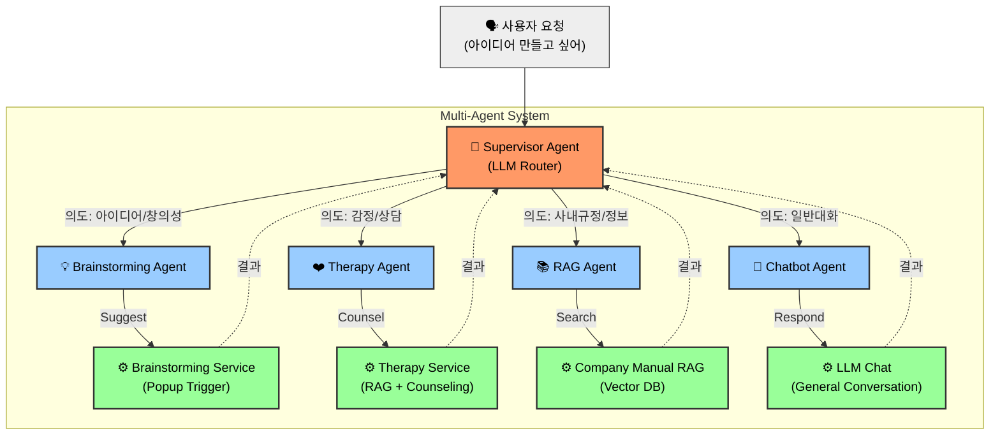

# Multi-Agent Orchestration Flow

```mermaid
graph TD
    %% 스타일 정의
    classDef supervisor fill:#f96,stroke:#333,stroke-width:2px,color:black;
    classDef agent fill:#9cf,stroke:#333,stroke-width:2px,color:black;
    classDef module fill:#9f9,stroke:#333,stroke-width:2px,color:black;
    classDef input fill:#eee,stroke:#333,stroke-width:1px,color:black;

    %% 노드 정의 (따옴표 문제 해결을 위해 전체를 따옴표로 감싸고 내부 따옴표 제거)
    UserRequest["🗣️ 사용자 요청<br/>(아이디어 만들고 싶어)"]:::input
    
    subgraph "Multi-Agent System"
        Supervisor["🤖 Supervisor Agent<br/>(LLM Router)"]:::supervisor
        
        %% 에이전트들
        BrainAgent["💡 Brainstorming Agent"]:::agent
        TherapyAgent["❤️ Therapy Agent"]:::agent
        RagAgent["📚 RAG Agent"]:::agent
        ChatAgent["💬 Chatbot Agent"]:::agent
        
        %% 실제 모듈/서비스
        BrainModule["⚙️ Brainstorming Service<br/>(Popup Trigger)"]:::module
        TherapyModule["⚙️ Therapy Service<br/>(RAG + Counseling)"]:::module
        RagModule["⚙️ Company Manual RAG<br/>(Vector DB)"]:::module
        ChatModule["⚙️ LLM Chat<br/>(General Conversation)"]:::module
    end

    %% 흐름 연결
    UserRequest --> Supervisor
    
    Supervisor -- "의도: 아이디어/창의성" --> BrainAgent
    Supervisor -- "의도: 감정/상담" --> TherapyAgent
    Supervisor -- "의도: 사내규정/정보" --> RagAgent
    Supervisor -- "의도: 일반대화" --> ChatAgent
    
    %% 에이전트 -> 모듈 실행
    BrainAgent -->|Suggest| BrainModule
    TherapyAgent -->|Counsel| TherapyModule
    RagAgent -->|Search| RagModule
    ChatAgent -->|Respond| ChatModule
    
    %% 결과 반환 (간소화)
    BrainModule -.->|결과| Supervisor
    TherapyModule -.->|결과| Supervisor
    RagModule -.->|결과| Supervisor
    ChatModule -.->|결과| Supervisor
```
