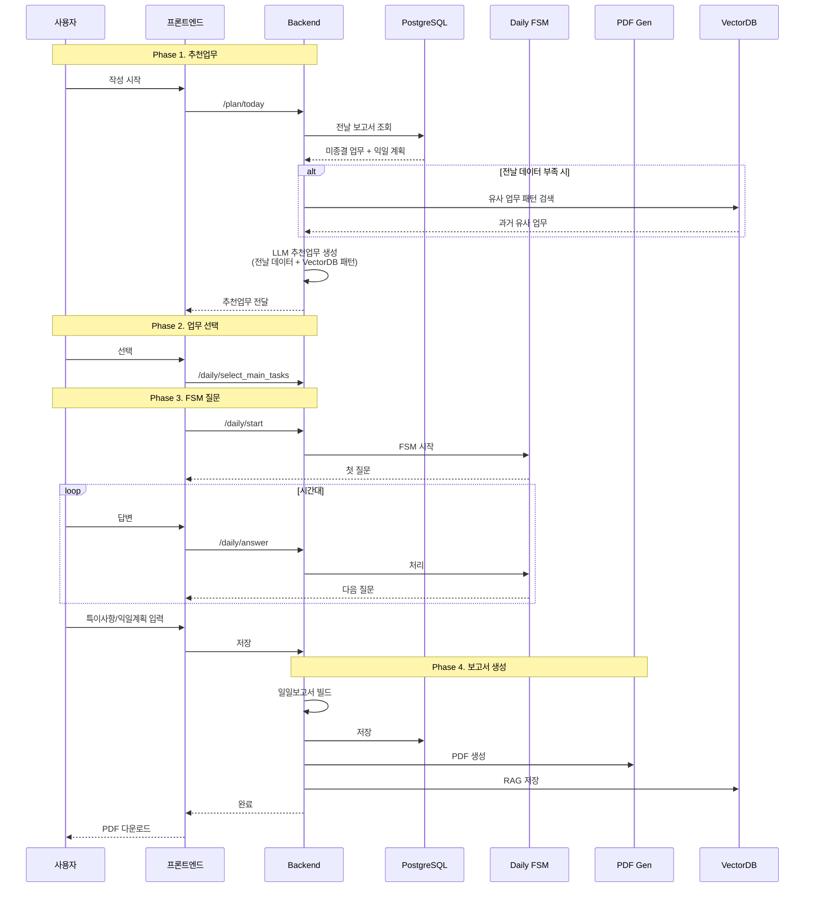

# 일일보고서 시스템 간략 플로우

## 📋 간략 시퀀스 다이어그램

---

## 🔑 핵심 포인트

### Phase 1: 추천업무
1. **PostgreSQL**: 전날 보고서에서 미종결 업무 + 익일 계획 추출
2. **VectorDB** (조건부): 전날 데이터가 없거나 부족할 때 과거 유사 업무 패턴 검색
3. **LLM**: 전날 데이터 + VectorDB 패턴을 결합하여 추천 업무 생성

### Phase 2: 업무 선택
- 사용자가 추천된 업무 중에서 선택
- 메모리에 임시 저장

### Phase 3: FSM 질문-답변
- 시간대별로 자연어 입력 받기
- LLM으로 구조화된 데이터로 변환
- 이슈사항, 익일 계획 수집

### Phase 4: 보고서 생성
- 의미적 유사도로 미종결 업무 자동 매칭
- PostgreSQL 저장
- PDF 생성 및 저장
- VectorDB 저장 (RAG 검색용)

