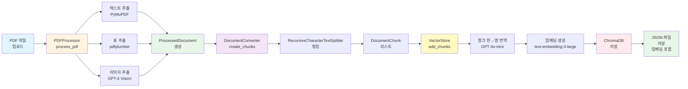
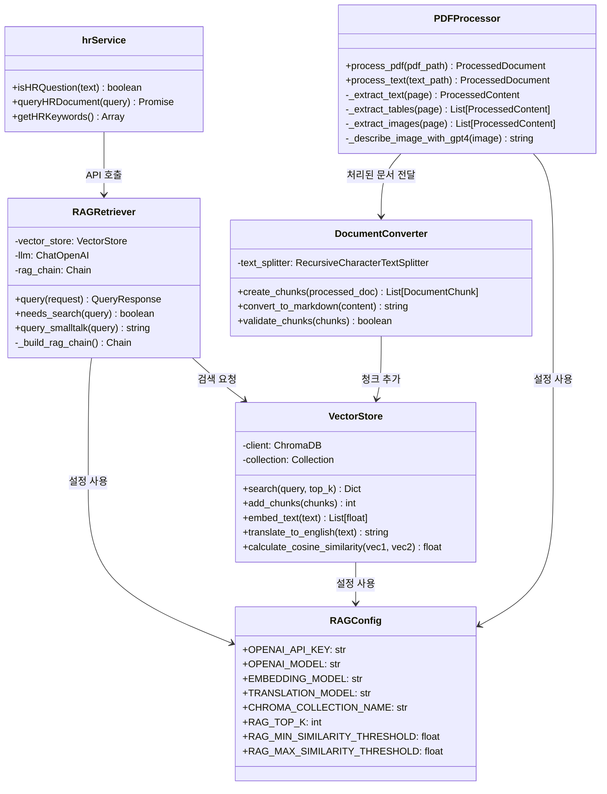
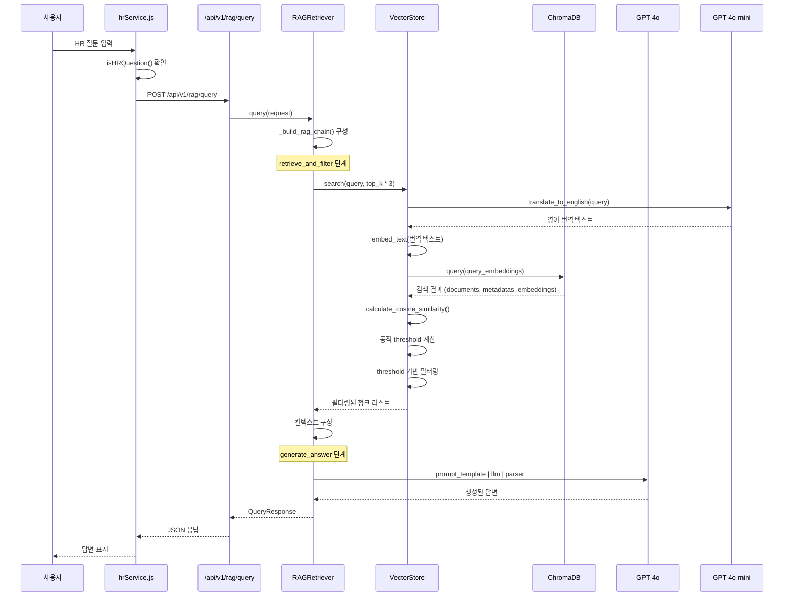
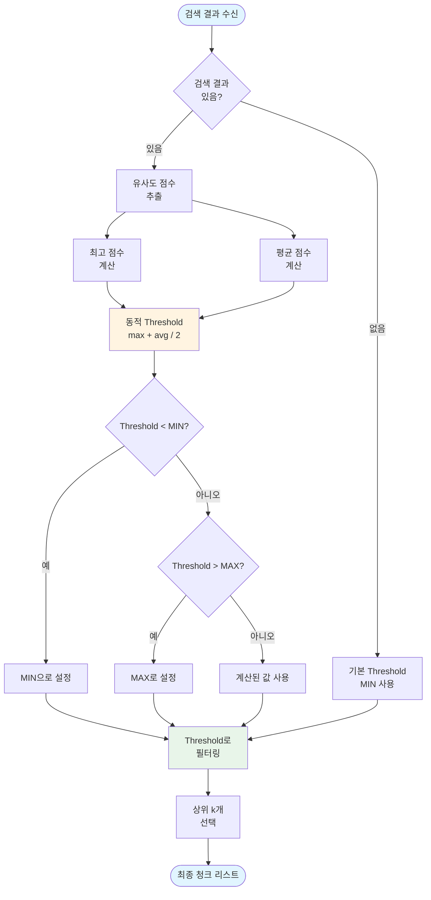
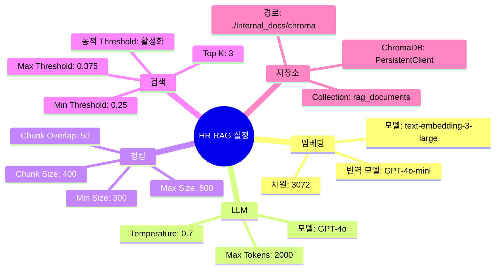

# HR RAG 시스템 아키텍처

## 전체 시스템 플로우

```mermaid
graph TB
    Start([사용자 질문 입력]) --> CheckHR{HR 키워드<br/>확인}
    CheckHR -->|HR 질문| CallAPI[hrService.js<br/>RAG API 호출]
    CheckHR -->|일반 질문| Other[일반 챗봇 처리]
    
    CallAPI --> APIEndpoint[/api/v1/rag/query<br/>FastAPI 엔드포인트]
    
    APIEndpoint --> RAGRetriever[RAGRetriever.query<br/>질의응답 처리]
    
    RAGRetriever --> BuildChain{RAG 체인<br/>구성}
    BuildChain --> RetrieveStep[retrieve_and_filter<br/>문서 검색 및 필터링]
    BuildChain --> GenerateStep[generate_answer<br/>답변 생성]
    
    RetrieveStep --> VectorSearch[VectorStore.search<br/>벡터 검색]
    
    VectorSearch --> TranslateQuery[쿼리 한→영 번역<br/>GPT-4o-mini]
    TranslateQuery --> EmbedQuery[쿼리 임베딩 생성<br/>text-embedding-3-large]
    EmbedQuery --> ChromaSearch[ChromaDB 검색<br/>top_k * 3]
    
    ChromaSearch --> CalcSimilarity[Cosine Similarity<br/>계산]
    CalcSimilarity --> DynamicThreshold[동적 Threshold<br/>계산 및 필터링]
    
    DynamicThreshold --> FilterChunks[상위 k개<br/>청크 선택]
    FilterChunks --> BuildContext[컨텍스트<br/>구성]
    
    BuildContext --> GenerateStep
    GenerateStep --> LLM[GPT-4o<br/>답변 생성]
    LLM --> Response[QueryResponse<br/>반환]
    
    Response --> Frontend[프론트엔드<br/>답변 표시]
    
    style Start fill:#e1f5ff
    style CheckHR fill:#fff4e1
    style CallAPI fill:#e8f5e9
    style APIEndpoint fill:#f3e5f5
    style RAGRetriever fill:#e3f2fd
    style VectorSearch fill:#fff9c4
    style LLM fill:#ffebee
    style Response fill:#e8f5e9
    style Frontend fill:#e1f5ff
```

## 데이터 흐름 (Document Ingestion)



## 컴포넌트 상세 구조



## RAG 체인 상세 플로우



## 동적 Threshold 계산 로직



## 주요 설정값



