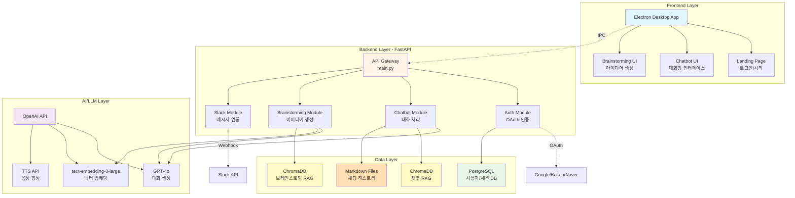
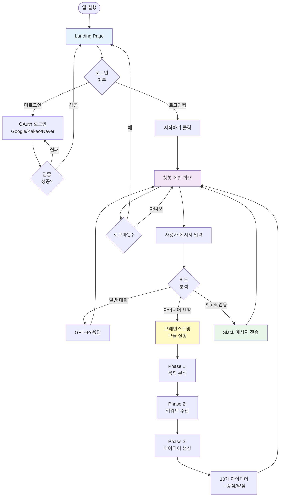
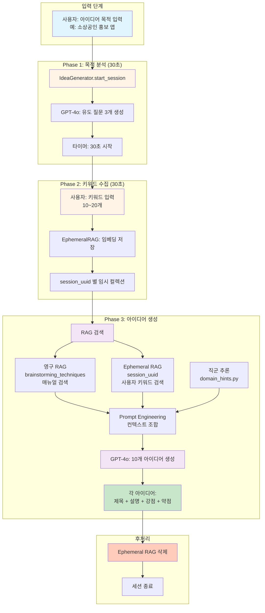
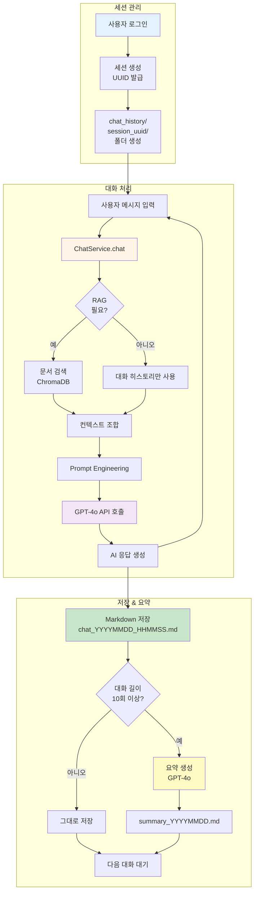
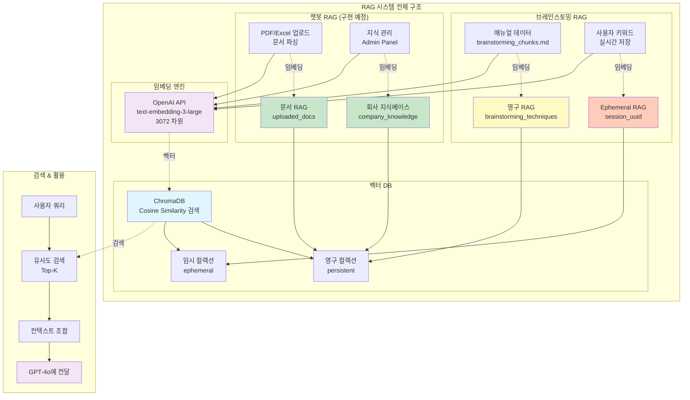
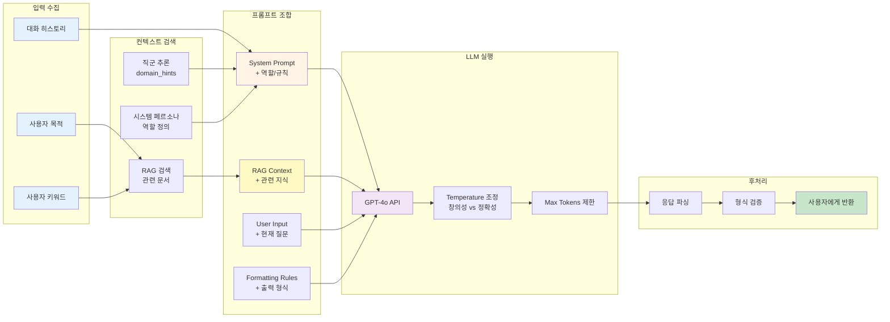
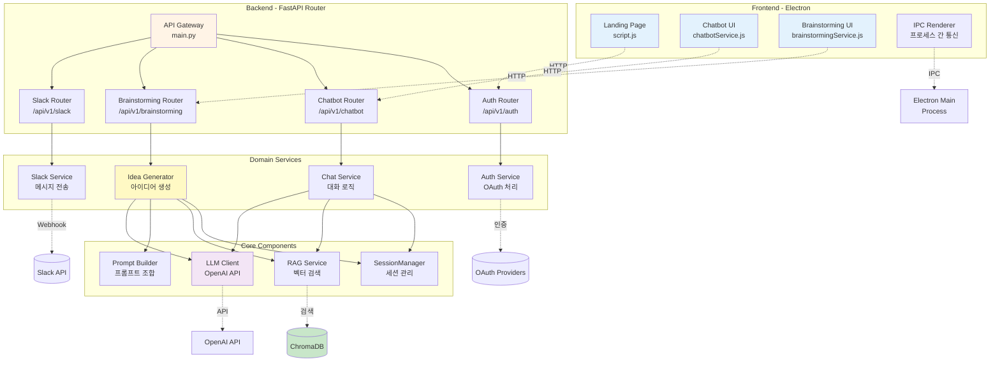
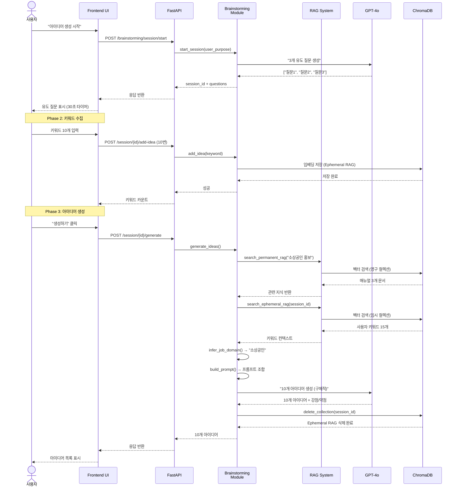
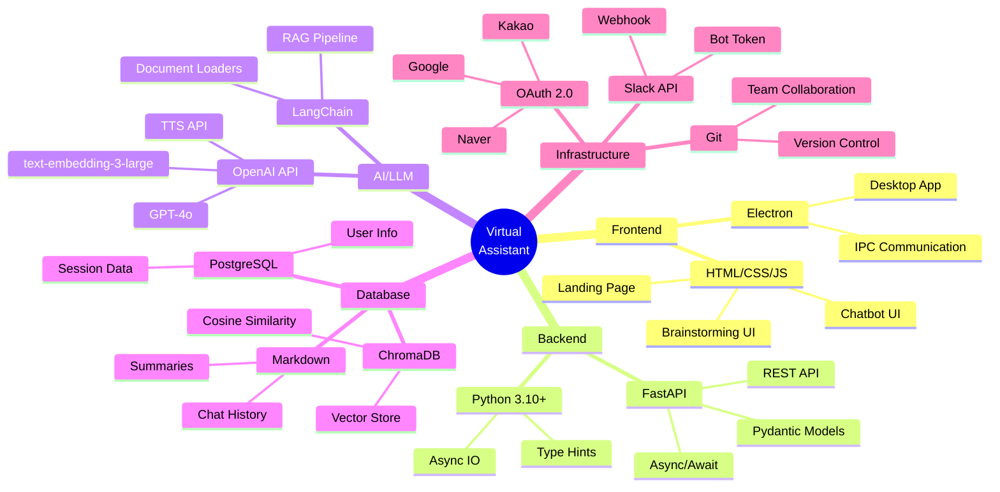
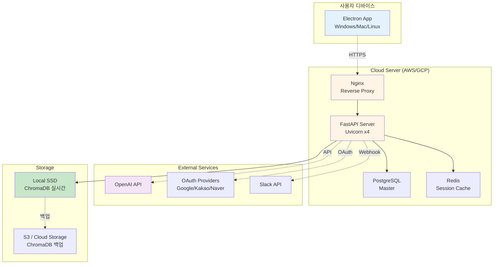

# Virtual Assistant - 시스템 플로우차트 & 관계도

> 중간발표용 시각화 자료  
> 작성일: 2025-11-25

---

## 📋 목차

1. [전체 시스템 아키텍처](#1-전체-시스템-아키텍처)
2. [사용자 플로우 (User Flow)](#2-사용자-플로우-user-flow)
3. [브레인스토밍 모듈 상세](#3-브레인스토밍-모듈-상세)
4. [챗봇 모듈 상세](#4-챗봇-모듈-상세)
5. [RAG 시스템 관계도](#5-rag-시스템-관계도)
6. [프롬프트 엔지니어링 플로우](#6-프롬프트-엔지니어링-플로우)
7. [모듈 간 통신 구조](#7-모듈-간-통신-구조)

---

## 1. 전체 시스템 아키텍처



---

## 2. 사용자 플로우 (User Flow)



---

## 3. 브레인스토밍 모듈 상세



---

## 4. 챗봇 모듈 상세



---

## 5. RAG 시스템 관계도



---

## 6. 프롬프트 엔지니어링 플로우



### 프롬프트 구조 예시

```
┌─────────────────────────────────────────────────┐
│ System Prompt (역할 정의)                        │
│ "당신은 실무 경험이 풍부한 기획자입니다."          │
└─────────────────────────────────────────────────┘
                      ↓
┌─────────────────────────────────────────────────┐
│ RAG Context (검색된 지식)                        │
│ - 브레인스토밍 기법 매뉴얼 3개 문서               │
│ - 사용자 키워드 15개                             │
└─────────────────────────────────────────────────┘
                      ↓
┌─────────────────────────────────────────────────┐
│ Domain Hints (직군별 가이드)                     │
│ "소상공인: 매출, 홍보, 예산, 이벤트 고려"         │
└─────────────────────────────────────────────────┘
                      ↓
┌─────────────────────────────────────────────────┐
│ User Input (현재 요청)                           │
│ "목적: 소상공인 홍보 앱"                         │
└─────────────────────────────────────────────────┘
                      ↓
┌─────────────────────────────────────────────────┐
│ Formatting Rules (출력 형식)                     │
│ "💡 아이디어 X: [제목]"                          │
│ "[설명 - 최소 3줄]"                              │
│ "✅ 강점 / ⚠️ 약점"                             │
└─────────────────────────────────────────────────┘
                      ↓
              [ GPT-4o 실행 ]
                      ↓
┌─────────────────────────────────────────────────┐
│ Output (10개 구체적 아이디어)                    │
└─────────────────────────────────────────────────┘
```

---

## 7. 모듈 간 통신 구조



---

## 8. 데이터 흐름 (Data Flow)



---

## 9. 기술 스택 맵



---

## 10. 주요 모듈별 책임 (Responsibility Map)

| 모듈 | 책임 | 입력 | 출력 |
|------|------|------|------|
| **Frontend** | UI 렌더링, 사용자 이벤트 처리 | 사용자 클릭/입력 | HTTP 요청 |
| **API Gateway** | 라우팅, 인증 검증 | HTTP 요청 | JSON 응답 |
| **Auth Module** | OAuth 인증, 토큰 관리 | 인증 코드 | 세션 쿠키 |
| **Chatbot Module** | 대화 처리, 히스토리 저장 | 사용자 메시지 | AI 응답 |
| **Brainstorming Module** | 아이디어 생성, RAG 검색 | 목적 + 키워드 | 10개 아이디어 |
| **RAG Service** | 벡터 검색, 임베딩 생성 | 쿼리 텍스트 | 관련 문서 |
| **SessionManager** | 세션 생성/관리/삭제 | 사용자 ID | 세션 ID |
| **LLM Client** | OpenAI API 호출 | 프롬프트 | AI 응답 |
| **Prompt Builder** | 프롬프트 조합, 컨텍스트 구성 | RAG 결과 + 사용자 입력 | 완성된 프롬프트 |
| **Slack Module** | 메시지 전송, Webhook | 메시지 내용 | 전송 결과 |

---

## 11. 배포 아키텍처 (예정)



---

## 📊 발표 시 활용 팁

### **1. 전체 시스템 아키텍처** → 프로젝트 개요 소개
- "우리 프로젝트는 Electron 기반 데스크톱 앱으로..."
- Frontend → Backend → AI → Data 레이어 설명

### **2. 사용자 플로우** → 사용자 경험 설명
- "사용자가 앱을 실행하면..."
- 로그인 → 챗봇 → 브레인스토밍 흐름

### **3. 브레인스토밍 모듈 상세** → 핵심 기능 강조
- "3단계로 아이디어를 생성합니다"
- Phase별 타이머, RAG 활용 강조

### **4. RAG 시스템** → 기술적 차별화
- "영구 + 임시 RAG 이중 구조로..."
- ChromaDB, OpenAI 임베딩 활용

### **5. 프롬프트 엔지니어링** → AI 품질 향상 방법
- "단순 LLM 호출이 아니라..."
- 컨텍스트 조합, 직군별 힌트

### **6. 모듈 간 통신** → 아키텍처 설계 역량
- "DDD 구조로 모듈을 격리..."
- FastAPI Router, Domain Service 분리

---

## 🎨 시각화 도구 추천

### **Mermaid → 다른 도구 변환**

1. **draw.io (diagrams.net)**
   - 위 Mermaid 다이어그램을 참고하여 수동 작성
   - 더 예쁜 아이콘, 색상 커스터마이징

2. **Figma**
   - UI/UX 디자인 툴로 플로우차트 작성
   - 팀원과 공유 가능

3. **Lucidchart**
   - 전문 다이어그램 툴
   - Mermaid import 지원

4. **Excalidraw**
   - 손그림 스타일 다이어그램
   - 발표 자료에 친근한 느낌

---

## 📌 GitHub에서 보는 방법

이 파일을 GitHub에 푸시하면 Mermaid 다이어그램이 자동으로 렌더링됩니다!

```bash
git add SYSTEM_FLOWCHART.md
git commit -m "docs: 시스템 플로우차트 추가"
git push
```

---

**작성 완료!** 🎉

**추가 다이어그램이나 수정이 필요하면 말씀해주세요!** 😊

