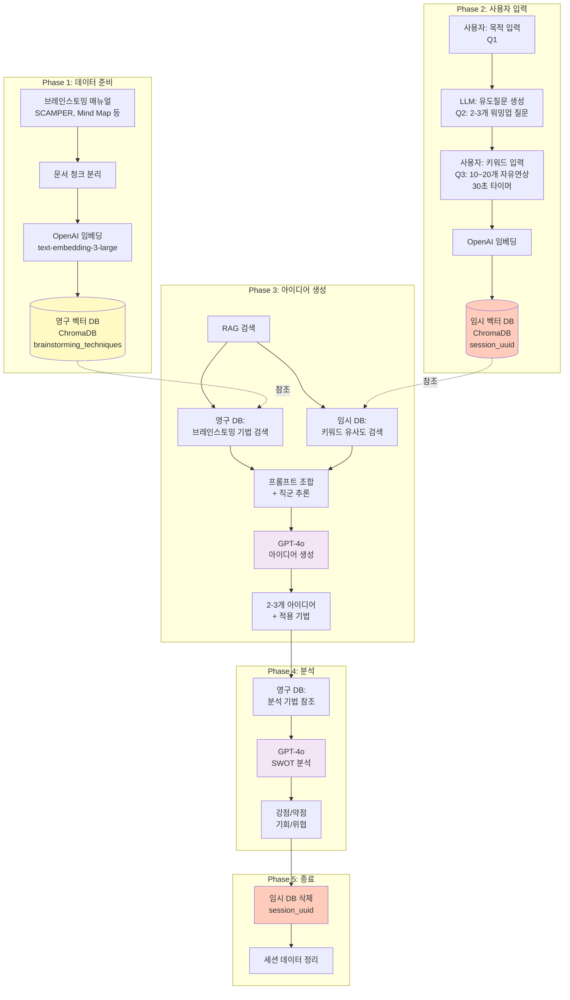
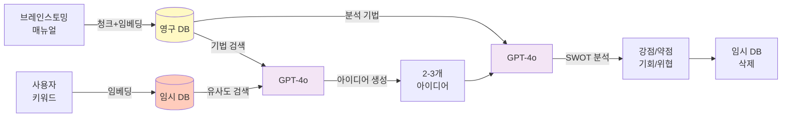

# 브레인스토밍 모듈 - 발표용 플로우차트

> 중간발표용 시각화 자료 (간결 버전)

---

## 📊 브레인스토밍 모듈 전체 플로우

---

## 🔄 핵심 데이터 흐름 (간단 버전)

---

## 📌 핵심 포인트

### **1. 이중 RAG 구조**
- **영구 RAG**: 브레인스토밍 기법 매뉴얼 (SCAMPER, Mind Map 등)
- **Ephemeral RAG**: 사용자 키워드 (세션별 임시 저장 → 종료 시 삭제)

### **2. 3단계 프로세스**
- **Q1**: 목적 입력 (예: "모바일 앱 아이디어")
- **Q2**: LLM이 워밍업 질문 생성 (직군별 맞춤)
- **Q3**: 30초 자유연상 (10~20개 키워드)

### **3. LLM 품질 향상**
- RAG로 브레인스토밍 기법 제공 → 구체적인 아이디어
- 직군 자동 추론 (유튜버, 회사원, 소상공인 등)
- 허구 데이터 금지 프롬프트 (현실적 실행 가능성)

### **4. 보안 & 메모리 관리**
- 임시 DB는 세션 종료 시 자동 삭제
- 아이디어 유출 방지
- 메모리 효율적 (파일 기반 ChromaDB)

---

## 🎨 발표 시 설명 예시

> "**브레인스토밍 모듈**은 **이중 RAG 구조**를 사용합니다.  
> 
> **첫째**, 브레인스토밍 매뉴얼을 청크로 나눠 **영구 벡터 DB**에 저장합니다.  
> 
> **둘째**, 사용자가 입력한 키워드를 **임시 벡터 DB**에 저장하고,  
> 세션 종료 시 자동으로 삭제하여 **아이디어 유출을 방지**합니다.  
> 
> **셋째**, 두 DB를 동시에 검색하여 **GPT-4o**에게 전달하면,  
> **구체적이고 실행 가능한 아이디어**를 생성합니다.  
> 
> **마지막**으로, 생성된 아이디어를 **SWOT 분석**하여  
> **강점/약점/기회/위협**을 제시합니다."

---

**작성 완료!** 🎉

