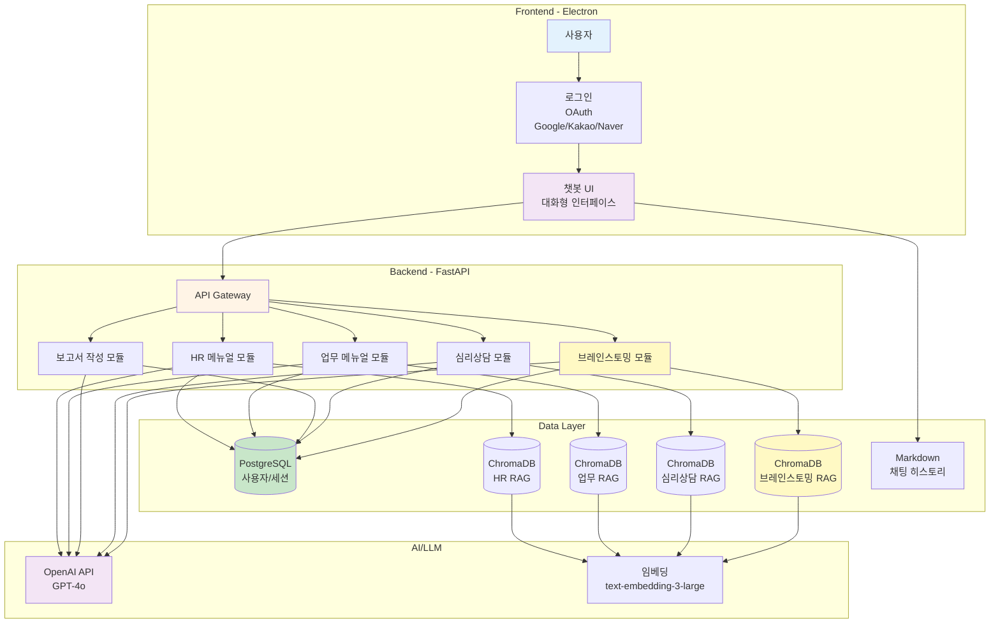
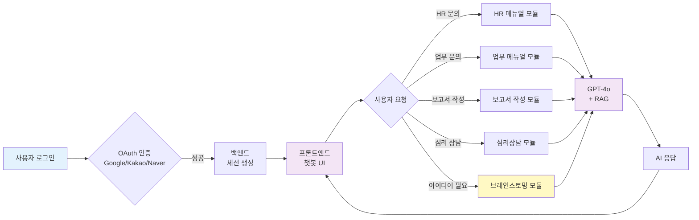
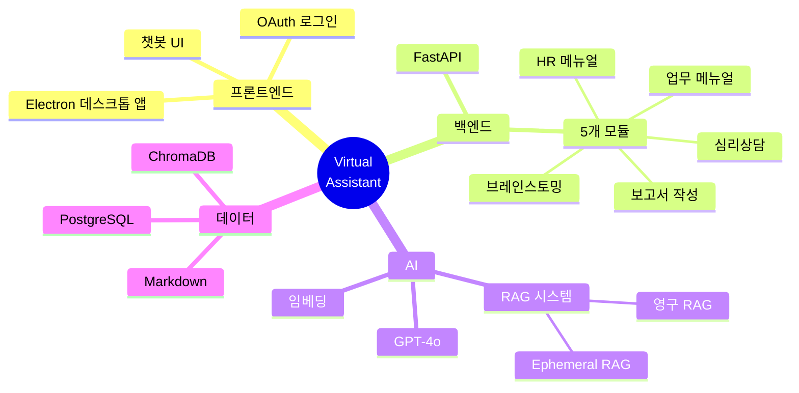
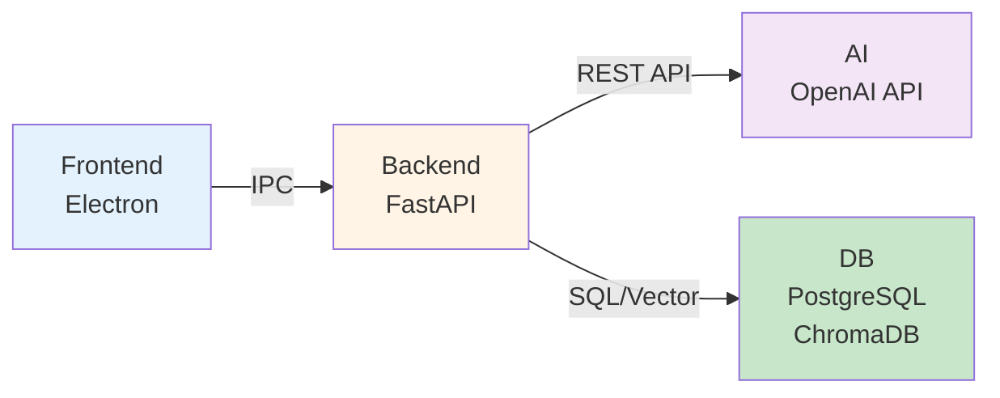

# Virtual Assistant - 전체 아키텍처

> 중간발표용 시각화 자료 (간결 버전)

---

## 🏗️ 전체 시스템 아키텍처

---

## 🔄 사용자 플로우 (간단 버전)

---

## 📊 모듈별 구조

---

## 🎯 5개 모듈 상세

| 모듈 | 기능 | RAG 사용 | 담당자 |
|------|------|----------|--------|
| **HR 메뉴얼** | 사내 인사 규정 안내 | ✅ 영구 RAG | 팀원 A |
| **업무 메뉴얼** | 업무 프로세스 가이드 | ✅ 영구 RAG | 팀원 B |
| **보고서 작성** | 자동 보고서 생성 | ❌ LLM만 | 팀원 C |
| **심리상담** | 심리 상담 챗봇 | ✅ 영구 RAG | 팀원 D |
| **브레인스토밍** | 아이디어 생성 | ✅ 영구 + Ephemeral RAG | 김진모 |

---

## 🔧 기술 스택

### **Frontend**
- Electron (데스크톱 앱)
- HTML/CSS/JavaScript

### **Backend**
- FastAPI (Python)
- Pydantic (데이터 검증)
- OAuth 2.0 (인증)

### **AI/LLM**
- OpenAI GPT-4o (대화 생성)
- text-embedding-3-large (임베딩)
- LangChain (RAG 파이프라인)

### **Database**
- PostgreSQL (사용자/세션)
- ChromaDB (벡터 DB)
- Markdown (채팅 히스토리)

---

## 📌 핵심 특징

### **1. 모듈 격리 (DDD)**
- 각 팀원이 독립적으로 개발
- `backend/app/domain/[모듈명]/` 구조
- 코드 충돌 최소화

### **2. RAG 시스템**
- 모듈별 독립적인 ChromaDB 컬렉션
- 영구 RAG (매뉴얼 저장)
- Ephemeral RAG (임시 데이터, 브레인스토밍 전용)

### **3. OAuth 통합**
- Google, Kakao, Naver 로그인 지원
- 세션 기반 사용자 관리

### **4. 채팅 히스토리**
- Markdown 파일로 저장
- 10회마다 자동 요약
- 세션별 관리

---

## 🎨 발표 시 설명 예시

> "**Virtual Assistant**는 **Electron 기반 데스크톱 앱**으로,  
> **5개의 모듈**이 독립적으로 작동합니다.  
> 
> 사용자가 **챗봇**과 대화하면,  
> **백엔드**에서 **GPT-4o**와 **RAG 시스템**을 활용하여  
> **정확하고 구체적인 답변**을 제공합니다.  
> 
> 특히 **브레인스토밍 모듈**은 **이중 RAG 구조**를 사용하여  
> **실행 가능한 아이디어**를 생성하고,  
> **SWOT 분석**까지 자동으로 수행합니다.  
> 
> 모든 모듈은 **DDD 구조**로 완전히 격리되어,  
> 팀원들이 **충돌 없이 병렬 개발**할 수 있습니다."

---

## 🚀 향후 계획

### **Phase 1 (현재)** ✅
- 5개 모듈 개발 완료
- OAuth 로그인
- 기본 챗봇 기능

### **Phase 2 (예정)**
- Slack 연동
- TTS (음성 합성)
- 협업 기능 (여러 사용자)

### **Phase 3 (배포)**
- AWS/GCP 클라우드 배포
- HTTPS 적용
- 프로덕션 최적화

---

**작성 완료!** 🎉

